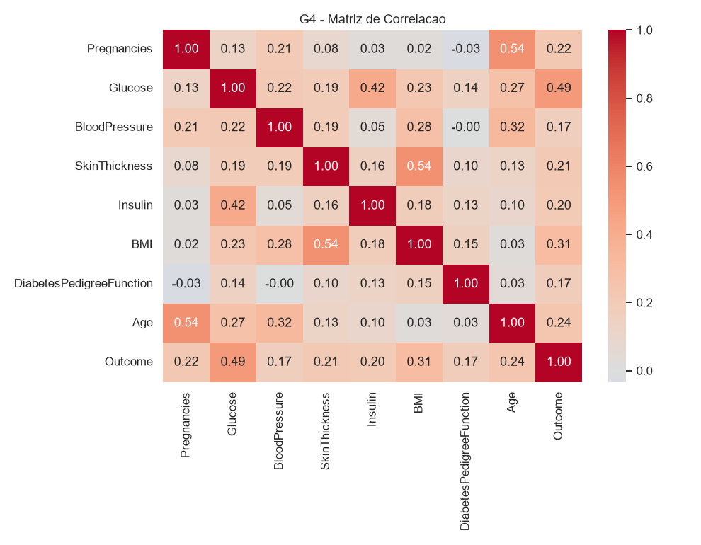
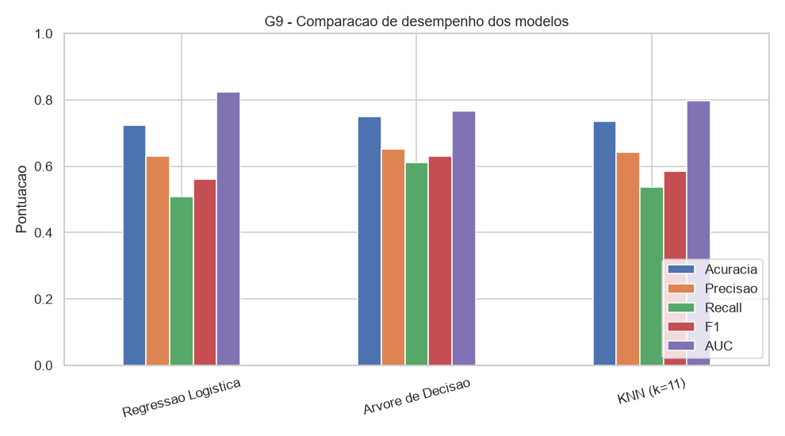

<h1 align="center">🩺 Análise e Predição de Diabetes</h1>

<p align="center">
  Projeto prático da disciplina de <b>Ciência de Dados</b> (CEUB) que aplica o ciclo completo de Ciência de Dados sobre <b>dois datasets públicos de saúde</b> — da coleta e limpeza dos dados à modelagem preditiva — para identificar padrões e prever a ocorrência de diabetes.
</p>

<p align="center">
  
  
  
  
  
  
</p>

---

## 📑 Sumário

- [Visão Geral](#-visão-geral)
- [Objetivos](#-objetivos)
- [Datasets](#-datasets)
- [Indicadores (KPIs)](#-indicadores-kpis)
- [Conceitos de Ciência de Dados aplicados](#-conceitos-de-ciência-de-dados-aplicados)
- [Metodologia](#-metodologia)
- [Modelagem e Resultados](#-modelagem-e-resultados)
- [Estrutura do Projeto](#-estrutura-do-projeto)
- [Como Executar](#-como-executar)
- [Autoria](#-autoria)

---

## 🔍 Visão Geral

A diabetes é uma doença crônica de grande impacto em saúde pública. Este projeto utiliza dados clínicos públicos para:

- **Analisar** os fatores associados à diabetes (estatística descritiva e correlações);
- **Construir indicadores (KPIs)** que resumem a situação da amostra;
- **Prever** a ocorrência de diabetes (classificação) e a progressão da doença (regressão);
- **Agrupar** pacientes em perfis de risco (clusterização) e descobrir **regras de associação** entre fatores de risco.

## 🎯 Objetivos

1. Aplicar todas as etapas do ciclo de Ciência de Dados sobre datasets reais.
2. Gerar pelo menos 20 indicadores e 8 visualizações interpretáveis.
3. Comparar diferentes algoritmos de Machine Learning e avaliá-los com métricas adequadas.

## 🗂 Datasets

| # | Dataset | Tamanho | Alvo | Fonte |
|---|---------|---------|------|-------|
| 1 | **Pima Indians Diabetes** | 768 pacientes · 9 variáveis | Classificação (tem / não tem diabetes) | [National Institute of Diabetes (Kaggle)](https://www.kaggle.com/datasets/uciml/pima-indians-diabetes-database) |
| 2 | **Diabetes Progression** | 442 pacientes · 11 variáveis | Regressão (progressão da doença) | [Efron et al. (2004) — scikit-learn](https://scikit-learn.org/stable/datasets/toy_dataset.html#diabetes-dataset) |

## 📊 Indicadores (KPIs)

Foram construídos **25 KPIs**. Alguns destaques:

<details>
<summary><b>Ver principais indicadores</b></summary>

| Indicador | Valor |
|-----------|-------|
| Prevalência de diabetes | 34,9% |
| Pacientes obesos | 62,9% |
| Glicose média — diabéticos | 142 |
| Glicose média — não-diabéticos | 111 |
| Taxa de diabetes entre obesos | 45,8% |
| Taxa de diabetes entre não-obesos | 16,5% |
| Correlação Glicose × Diabetes | 0,49 |
| Idade média | 33,2 anos |

</details>

## 🧠 Conceitos de Ciência de Dados aplicados

> Foram aplicados **9 de 9** conceitos da disciplina (o mínimo exigido era 8).

1. Coleta de Dados
2. Limpeza, Pré-processamento e Integração
3. Estatística Descritiva
4. Construção de Indicadores (KPIs)
5. Visualização de Dados / Storytelling
6. Feature Engineering
7. Modelagem Preditiva (Regressão Logística, Árvore de Decisão, KNN, Regressão Linear)
8. Machine Learning (K-Means e Regras de Associação Apriori)
9. Métricas de Avaliação (Precisão, Recall, F1, Matriz de Confusão, Validação Cruzada, ROC)

## ⚙️ Metodologia

1. **Coleta** — carregamento dos dois datasets públicos.
2. **Limpeza** — valores `0` biologicamente impossíveis tratados como ausentes e imputados pela mediana.
3. **Integração** — união dos dois datasets em uma coorte de 1.210 pacientes pelas variáveis em comum.
4. **Feature Engineering** — criação de faixas etárias, categorias de IMC, nível de glicose, etc.
5. **Modelagem e Avaliação** — treino/teste estratificado (75/25), normalização e validação cruzada 5-fold.

## 🤖 Modelagem e Resultados

Três algoritmos foram comparados na tarefa de **prever diabetes**:

| Modelo | Acurácia | Precisão | Recall | F1 | AUC |
|--------|:--------:|:--------:|:------:|:--:|:---:|
| Regressão Logística | 0,724 | 0,630 | 0,507 | 0,562 | **0,824** |
| **Árvore de Decisão** ⭐ | **0,750** | 0,651 | 0,612 | **0,631** | 0,767 |
| KNN (k=11) | 0,734 | 0,643 | 0,537 | 0,585 | 0,797 |

➡️ **Melhor modelo: Árvore de Decisão** (F1 ≈ 0,63), sem overfitting relevante (acurácia treino 0,83 × teste 0,75).

| Matriz de correlação | Comparação dos modelos |
|:---:|:---:|
|  |  |

**Principais insights:**
- Glicose é o fator mais associado ao diabetes; IMC vem em seguida.
- Obesos têm quase **3x mais diabetes** que não-obesos.
- Regra de associação de maior destaque: *glicose alta + obesidade + histórico familiar* → diabético (confiança 75%, lift 2,1).

## 📁 Estrutura do Projeto

```
projeto-ciencia-dados-diabetes/
├── notebooks/
│   └── Projeto_Diabetes.ipynb     # Análise completa (código + texto + gráficos)
├── scripts/
│   ├── preparar_dados.py          # Baixa/gera os 2 datasets públicos
│   └── analise_diabetes.py        # Mesma análise em formato de script
├── data/
│   ├── pima_diabetes.csv
│   └── diabetes_progressao.csv
├── figuras/                       # 15 gráficos gerados (PNG)
├── requirements.txt
└── README.md
```

## ▶️ Como Executar

```bash
# 1. Instalar as bibliotecas
pip install -r requirements.txt

# 2. Baixar/gerar os datasets (cria a pasta data/)
python scripts/preparar_dados.py

# 3a. Abrir a análise no Jupyter (recomendado)
jupyter notebook notebooks/Projeto_Diabetes.ipynb

# 3b. Ou rodar como script (resultados no terminal + gráficos em figuras/)
python scripts/analise_diabetes.py
```

> 💡 O notebook também baixa os dados automaticamente caso a pasta `data/` não exista.

## 👤 Autoria

Projeto desenvolvido para a disciplina de **Ciência de Dados** — CEUB.

- [@Alves56](https://github.com/Alves56)
