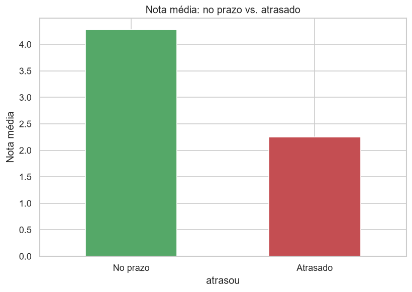

<h1 align="center">🛒 Satisfação do Cliente no E-commerce</h1>

<p align="center">
  Projeto prático da disciplina de <b>Ciência de Dados</b> (CEUB) que aplica o ciclo completo de Ciência de Dados sobre dados reais de e-commerce brasileiro (<b>Olist, ~100 mil pedidos</b>) para entender <b>o que faz um cliente avaliar bem ou mal</b> uma compra online — e prever a insatisfação.
</p>

<p align="center">
  
  
  
  
  
</p>

---

## 📑 Sumário
- [Visão Geral](#-visão-geral)
- [Dados](#-dados)
- [Conceitos de Ciência de Dados](#-conceitos-de-ciência-de-dados-aplicados)
- [Metodologia](#-metodologia)
- [Resultados](#-resultados)
- [Estrutura do Projeto](#-estrutura-do-projeto)
- [Como Executar](#-como-executar)
- [Autoria](#-autoria)

## 🔍 Visão Geral
No e-commerce, a avaliação do cliente afeta diretamente as vendas e a reputação da loja. Usando ~100 mil pedidos reais da **Olist**, o projeto investiga:

> **O que faz um cliente dar uma avaliação boa ou ruim — e dá para prever a insatisfação?**

## 🗂 Dados
Conjunto público **Brazilian E-Commerce Public Dataset by Olist** (2016–2018). Foram usadas **6 tabelas integradas** pelas chaves comuns:

| Tabela | Conteúdo | Liga por |
|--------|----------|----------|
| Pedidos | datas de compra e entrega | `order_id` |
| Avaliações | nota de 1 a 5 (**alvo**) | `order_id` |
| Itens | preço e frete | `order_id`, `product_id` |
| Pagamentos | tipo e parcelas | `order_id` |
| Produtos | categoria | `product_id` |
| Clientes | estado / região | `customer_id` |

Fonte: [Olist no Kaggle](https://www.kaggle.com/datasets/olistbr/brazilian-ecommerce).

## 🧠 Conceitos de Ciência de Dados aplicados
Os **9 conceitos** da disciplina:
1. Coleta de Dados
2. Limpeza, Integração e Transformação
3. Estatística Descritiva
4. Indicadores (KPIs) — **24**
5. Visualização de Dados (Storytelling)
6. Feature Engineering
7. Modelagem Preditiva (Regressão Logística, Árvore de Decisão, KNN, Regressão Linear)
8. Machine Learning (K-Means e Regras de Associação Apriori)
9. Métricas de Avaliação (Precisão, Recall, F1, Matriz de Confusão, Validação Cruzada)

## ⚙️ Metodologia
1. **Coleta** — carregamento das 6 tabelas do Olist.
2. **Limpeza/Integração** — manutenção de pedidos entregues, conversão de datas e união das tabelas (1 linha por pedido).
3. **Feature Engineering** — criação de tempo de entrega, atraso, satisfação e região.
4. **Exploração** — estatística descritiva, KPIs e gráficos.
5. **Modelagem e Avaliação** — classificação e regressão, com treino/teste estratificado (75/25) e validação cruzada.

## 📊 Resultados

**O insight central:** a experiência de entrega define a avaliação.

| | Nota média | Clientes satisfeitos |
|---|:---:|:---:|
| **Entregue no prazo** | 4,28 | 82% |
| **Entregue atrasado** | 2,26 | 26% |

Modelos de classificação (prever cliente satisfeito):

| Modelo | Acurácia | F1 | AUC |
|--------|:--------:|:--:|:---:|
| Regressão Logística | 0,811 | 0,891 | 0,688 |
| **Árvore de Decisão** ⭐ | **0,821** | **0,897** | **0,694** |
| KNN (k=15) | 0,816 | 0,893 | 0,669 |

| Insight da entrega | Correlações |
|:---:|:---:|
|  |  |

**Outros achados:**
- Regra de associação: *atraso + frete alto* → cliente insatisfeito (confiança ~76%, **lift ~5,7**).
- A maioria dos clientes compra uma única vez (segmentação RFM com K-Means).

## 📁 Estrutura do Projeto
```
projeto-ciencia-dados-ecommerce/
├── notebooks/
│   └── Projeto_Olist.ipynb        # Análise completa (código + texto + gráficos)
├── scripts/
│   ├── preparar_dados.py          # Baixa as tabelas do Olist
│   └── analise_olist.py           # Mesma análise em formato de script
├── figuras/                       # Gráficos gerados (PNG)
├── requirements.txt
└── README.md
```

## ▶️ Como Executar
```bash
# 1. Instalar as bibliotecas
pip install -r requirements.txt

# 2. Baixar as tabelas do Olist (cria a pasta data/)
python scripts/preparar_dados.py

# 3a. Abrir a análise no Jupyter (recomendado)
jupyter notebook notebooks/Projeto_Olist.ipynb

# 3b. Ou rodar como script (resultados no terminal + gráficos em figuras/)
python scripts/analise_olist.py
```
> O notebook baixa os dados automaticamente caso a pasta `data/` não exista.

## 👤 Autoria
Projeto desenvolvido para a disciplina de **Ciência de Dados** — CEUB.
- [@Alves56](https://github.com/Alves56)
